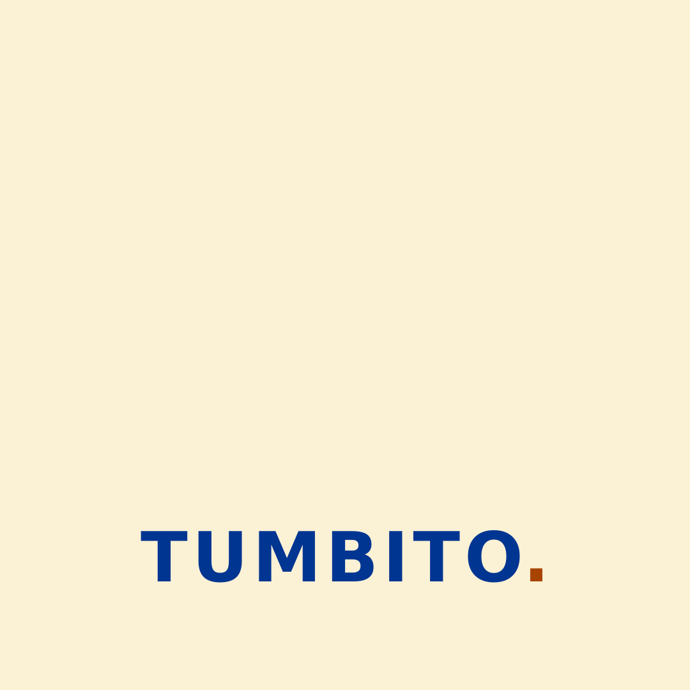

# Tumbito — Trabajo Final Integrador 2026

Aplicación móvil de gestión de restaurante para la Tecnicatura Universitaria en Programación (UTN Avellaneda).

## Estado actual

La aplicación Angular + Ionic está integrada y verificada. La entrega actual incluye:

- identidad visual basada en el logo entregado;
- recurso de splash estática y pantalla de presentación con el ícono centrado;
- pantalla de bienvenida separada con marca, ingreso y metadata institucional;
- formulario de ingreso con validación visible de correo y clave;
- accesos rápidos por perfiles autorizados;
- sesión, cierre de sesión y navegación por pantalla;
- centro de operación responsive para el flujo de los puntos 1 a 22;
- servicios desacoplados para altas, catálogo, mesas, espera, pedidos, cocina, bar, juegos, encuestas, cuenta, propina y pago.

La capa de Supabase está implementada y verificada: el esquema con RLS vive en `supabase/migrations`, y la autenticación real, los accesos rápidos leídos de la base, el control de estados pendiente/rechazado y la restauración de sesión están en `src/app/core`.

La aplicación está desplegada en Vercel y disponible en [tumbito.vercel.app](https://tumbito.vercel.app).

La configuración de Supabase se gestiona mediante variables de entorno protegidas. Nunca se guardan claves privadas ni claves `service_role` en el repositorio.

## Perfiles de acceso

Los accesos rápidos se generan a partir de los usuarios aprobados existentes en Supabase. Las credenciales se administran mediante la configuración segura del entorno y no se publican en este README.

| Correo | Perfil |
|---|---|
| mateo@tumbo.demo | Dueño |
| ramiro@tumbo.demo | Supervisor |
| ignacio@tumbo.demo | Maitre |
| matias@tumbo.demo | Mozo |
| alicia@tumbo.demo | Cocinero |
| bruno@tumbo.demo | Cantinero |
| camila@tumbo.demo | Cliente registrado |
| anonimo@tumbo.demo | Cliente anónimo |

Después de ingresar, el botón Abrir centro de operación permite recorrer las funcionalidades disponibles para el perfil autenticado.

## Integrantes y responsabilidades preliminares

| Apellidos y nombres | Tareas asignadas | Branch | Inicio | Finalización |
|---|---|---|---|---|
| Terrile, Mateo (líder) | Arquitectura Angular/Ionic, navegación, integración y coordinación técnica | `terrile` | 25/08/2026 | 30/09/2026 |
| Bianucci, Ramiro | Identidad visual, ícono, recursos gráficos, splash estática y contraste | `bianucci` | 25/08/2026 | 12/09/2026 |
| Cruz, Ignacio Agustín | Splash dinámica, transición de presentación y animaciones responsive | `cruz` | 26/08/2026 | 15/09/2026 |
| Ferrari, Matías Gabriel | Formulario, validaciones, Supabase Auth, accesos rápidos, sesión y logout | `ferrari` | 26/08/2026 | 25/09/2026 |

La rama `main` queda reservada para la versión integrada que se presenta.

## Identidad visual

| Uso | Color |
|---|---|
| Amarillo de marca | #FBB103 |
| Crema brillante | #FCEDBB |
| Naranja sombreado | #DC5B02 |
| Fondo crema | #FBF1D5 |
| Azul de acento | #006AE7 |
| Azul brillante | #F8FBFD |
| Azul sombreado | #003592 |

Se usa #003592 para texto corriente por contraste, #006AE7 para acciones y títulos destacados, y amarillo/naranja para la marca y estados.

## Recursos

- [Ícono](docs/imagenes/logo.png)
- [Logo con nombre](docs/imagenes/logo-nombre.png)
- [Splash estática](docs/imagenes/splash-estatica.svg)
- [Puesta en marcha de Supabase](supabase/README.md)
- [Consigna original del TFI](docs/Trabajo-practico-2026-TFI.pdf)
- [Contexto ampliado del proyecto](CONTEXTO-PROYECTO.md)
- [Manual visual de referencia](docs/manual-tfi.html)
- [Reglas para agentes y equipo](AGENTS.md)

## Índice visual

### Identidad y presentación

### Códigos QR

- [QR de ingreso](docs/imagenes/qr-entrada.png)
- [QR de mesa 1](docs/imagenes/qr-mesa-1.png)
- [QR de mesa 2](docs/imagenes/qr-mesa-2.png)
- [QR de mesa 3](docs/imagenes/qr-mesa-3.png)
- [QR de mesa 4](docs/imagenes/qr-mesa-4.png)
- [QR de mesa 5](docs/imagenes/qr-mesa-5.png)
- [QR de propina 0%](docs/imagenes/qr-propina-0.png)
- [QR de propina 5%](docs/imagenes/qr-propina-5.png)
- [QR de propina 10%](docs/imagenes/qr-propina-10.png)
- [QR de propina 15%](docs/imagenes/qr-propina-15.png)
- [QR de propina 20%](docs/imagenes/qr-propina-20.png)

Las imágenes utilizadas por las pantallas y sus variantes se encuentran en `public/imagenes` y `assets/tumbito`.

## Arquitectura

    src/app/
    ├── core/
    │   ├── guards/
    │   ├── models/
    │   └── services/
    └── features/
        ├── presentacion/
        ├── ingreso/
        ├── inicio/
        └── operacion/

Las rutas de funcionalidades se cargan de forma lazy. La ruta `splash` muestra el ícono durante el primer render y deriva a `presentacion`, que contiene la pantalla de bienvenida interactiva. Los componentes usan standalone, signals, formularios reactivos y estilos SCSS mobile first. Capacitor queda inicializado en `capacitor.config.ts`; `npm run cap:sync` sincroniza el build web con las plataformas nativas.

## Criterios acordados

- Todo texto visible está en español y conserva sus tildes.
- No se usa alert().
- No se usa modo oscuro ni fondos blancos o negros puros.
- Los errores se muestran dentro de la pantalla.
- El logo se conserva como recurso original y se reutiliza sin deformarlo.
- La autenticación real utiliza Supabase Auth detrás de un adaptador desacoplado.
- Los accesos rápidos se cargan desde los perfiles autorizados de Supabase.
- El cierre de sesión invalida la sesión, limpia el estado de la aplicación y vuelve al ingreso.
- Las validaciones se aplican en la interfaz y se refuerzan con restricciones de la base.
- Las credenciales privadas nunca se guardan en el repositorio.
