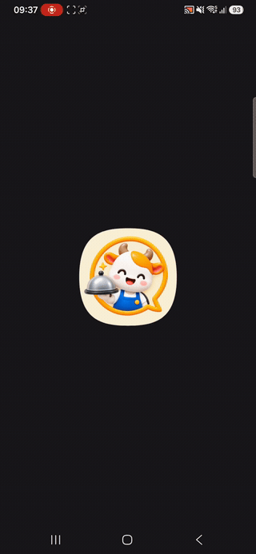
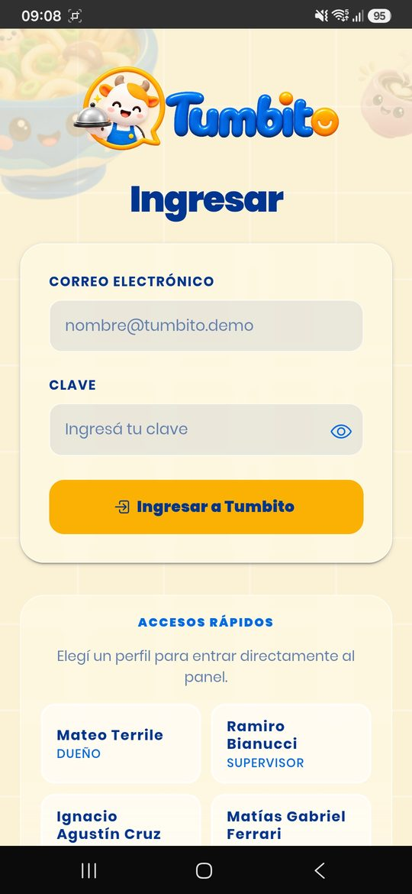
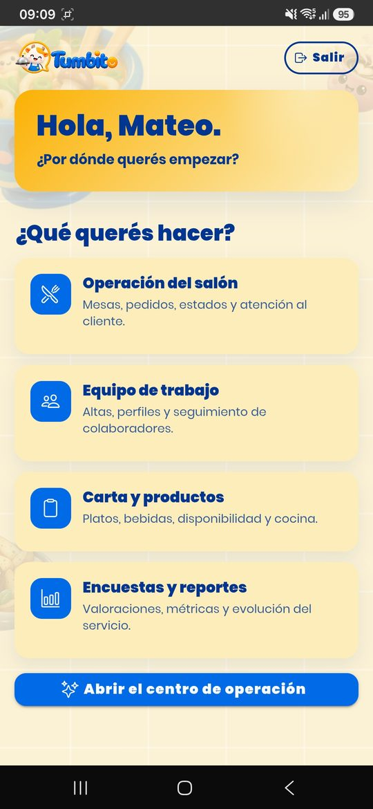
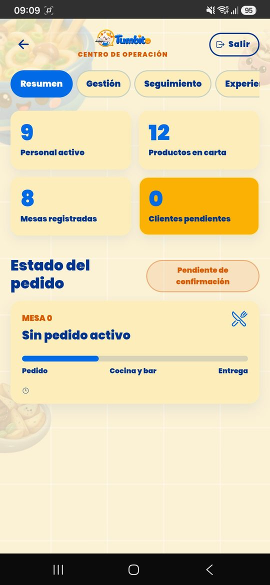
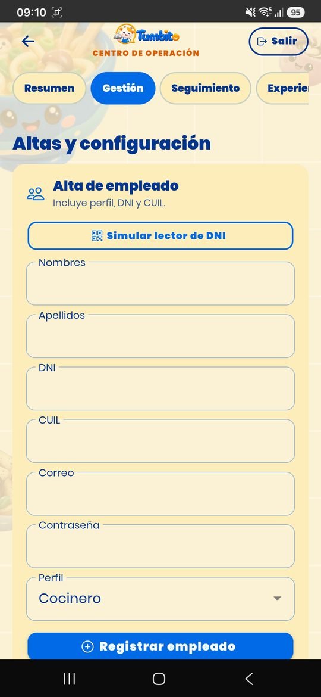
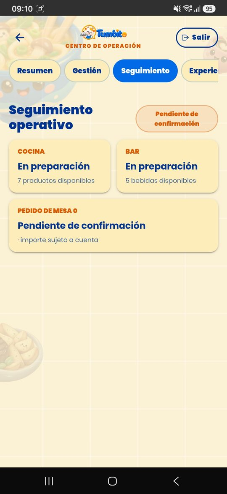
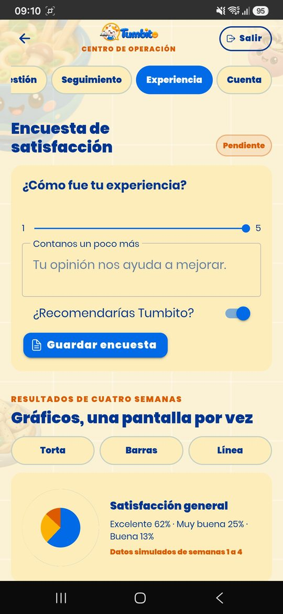
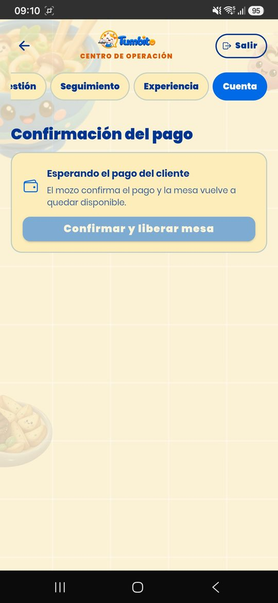

# Tumbito — Trabajo Final Integrador 2026

Aplicación móvil de gestión de restaurante para la Tecnicatura Universitaria en Programación (UTN Avellaneda).

## Estado actual

La aplicación Angular + Ionic está integrada y verificada. La entrega actual incluye:

- identidad visual basada en el logo entregado;
- splash animada con el logo, que deriva a la pantalla de presentación;
- fondo decorativo con las ilustraciones de la marca, servidas en el tamaño que le corresponde a cada pantalla;
- pantalla de bienvenida separada con marca, ingreso y metadata institucional;
- formulario de ingreso con validación visible de correo y clave;
- accesos rápidos por perfiles autorizados;
- sesión, cierre de sesión y navegación por pantalla;
- centro de operación responsive para el flujo de los puntos 1 a 22;
- servicios desacoplados para altas, catálogo, mesas, espera, pedidos, cocina, bar, juegos, encuestas, cuenta, propina y pago;
- sonido de apertura y de cierre, y vibración ante los errores;
- APK de Android empaquetada con Capacitor (ver [guía del APK](docs/apk.md)).

La capa de Supabase está implementada y verificada: el esquema con RLS vive en `supabase/migrations`, y la autenticación real, los accesos rápidos leídos de la base, el control de estados pendiente/rechazado y la restauración de sesión están en `src/app/core`. El alta de empleados se resuelve del lado del servidor con la Edge Function `supabase/functions/crear-empleado`, porque crear una cuenta con su contraseña requiere una clave privada que no puede viajar dentro del APK.

La aplicación está desplegada en Vercel y disponible en [tumbito.vercel.app](https://tumbito.vercel.app).

La configuración de Supabase se gestiona mediante variables de entorno protegidas. Nunca se guardan claves privadas ni claves `service_role` en el repositorio.

El reparto y el avance de los 22 puntos se sigue en el tablero de GitHub Projects del repositorio; el script que lo genera está en `tools/tablero`.

## Pantallas de la aplicación

Capturas tomadas del APK corriendo en un teléfono Android.

### 1 · Al entrar

Desde el ícono en el teléfono: la splash animada con el logo, el nombre del grupo y los apellidos y nombres de los cuatro integrantes, y su transición a la pantalla de presentación. También está en [video](docs/imagenes/pantallas/01-animacion-de-ingreso.mp4), con mejor calidad.

### Del 2 al 9 · Recorrido

<table>
  <tr>
    <td align="center" width="25%">
       
      <b>2 · Presentación</b> Bienvenida con la marca y los integrantes.
    </td>
    <td align="center" width="25%">
       
      <b>3 · Ingreso</b> Formulario validado y accesos rápidos leídos de la base.
    </td>
    <td align="center" width="25%">
       
      <b>4 · Inicio</b> Por dónde empezar, según el perfil que ingresó.
    </td>
    <td align="center" width="25%">
       
      <b>5 · Resumen</b> Personal, carta, mesas, clientes pendientes y estado del pedido.
    </td>
  </tr>
  <tr>
    <td align="center" width="25%">
       
      <b>6 · Alta de empleado</b> El punto 1, con el simulador del lector de DNI.
    </td>
    <td align="center" width="25%">
       
      <b>7 · Seguimiento</b> Cocina y bar, y en qué estado está el pedido.
    </td>
    <td align="center" width="25%">
       
      <b>8 · Experiencia</b> Encuesta de satisfacción y gráficos de resultados.
    </td>
    <td align="center" width="25%">
       
      <b>9 · Cuenta</b> Confirmación del pago y liberación de la mesa.
    </td>
  </tr>
</table>

## Perfiles de acceso

Los accesos rápidos se generan a partir de los usuarios aprobados existentes en Supabase. Las credenciales se administran mediante la configuración segura del entorno y no se publican en este README.

| Correo | Perfil |
|---|---|
| mateo@tumbo.demo | Dueño |
| ramiro@tumbo.demo | Supervisor |
| ignacio@tumbo.demo | Maitre |
| matias@tumbo.demo | Mozo |
| alicia@tumbo.demo | Cocinero |
| bruno@tumbo.demo | Cantinero |
| camila@tumbo.demo | Cliente registrado |
| anonimo@tumbo.demo | Cliente anónimo |

Después de ingresar, el botón Abrir centro de operación permite recorrer las funcionalidades disponibles para el perfil autenticado.

## Integrantes y responsabilidades

| Apellidos y nombres | Tareas asignadas | Branch | Inicio | Finalización |
|---|---|---|---|---|
| Terrile, Mateo (líder) | Arquitectura Angular/Ionic, navegación, diseño de presentación e ingreso, ilustraciones de marca, integración y coordinación técnica | `terrile` | 25/08/2026 | 30/09/2026 |
| Bianucci, Ramiro | Identidad visual, ícono, tipografías, recursos gráficos, contraste, configuración de Android Studio y sonidos de la aplicación | `bianucci` | 25/08/2026 | 12/09/2026 |
| Cruz, Ignacio Agustín | Base de Supabase, splash inicial, arreglos del formulario de ingreso y conexión del centro de operación con Supabase y realtime | `cruz` | 26/08/2026 | 15/09/2026 |
| Ferrari, Matías Gabriel | Esquema con RLS, Supabase Auth, accesos rápidos, sesión y logout, validaciones, requisitos excluyentes, empaquetado del APK y alta de empleado | `ferrari` | 26/08/2026 | 25/09/2026 |

La rama `main` queda reservada para la versión integrada que se presenta.

### Qué hizo cada uno

El detalle sale del historial del repositorio, no de la asignación previa: es lo que efectivamente está mergeado en `main`.

**Terrile, Mateo** — `terrile`

- Estructura inicial del proyecto Angular + Ionic, rutas y navegación entre pantallas.
- Diseño de la pantalla de presentación y del ingreso, con sus sucesivas remodelaciones.
- Componente compartido `fondo-decorativo`, que es el fondo animado de presentación e ingreso.
- Ilustraciones de Tumbito: originales, SVG, webp y previsualizaciones en `assets/tumbito`, más los íconos de `public/icons`.
- Integración de las ramas en `main` y coordinación técnica del equipo.

**Bianucci, Ramiro** — `bianucci`

- Tipografías del proyecto: la familia Poppins completa y Oh Chewy para la marca.
- Recursos gráficos e ilustraciones bajo `public/assets/tumbito`, con sus variantes y reportes de contraste.
- Ajustes de la pantalla de presentación y de los estilos globales.
- Configuración del proyecto en Android Studio y de los recursos nativos.
- Sonidos de la aplicación: apertura al iniciar y cierre al salir, con `AppAudio` sobre `native-audio`.

**Cruz, Ignacio Agustín** — `cruz`

- Primeras migraciones de Supabase y datos de prueba (`supabase/migrations`, `supabase/seed_data`).
- Primera versión de la splash screen y arreglos del formulario de ingreso.
- Conexión del centro de operación con Supabase y realtime: es la que convierte las pantallas de los puntos 2 a 22 en algo que lee y escribe en la base (`operacion.service.ts`, `operacion.component.ts`).

**Ferrari, Matías Gabriel** — `ferrari`

- Esquema completo con RLS, autenticación real de Supabase, accesos rápidos leídos de la base, control de estados pendiente y rechazado, y restauración de sesión.
- Seguridad de la base: cierre de la escalada de privilegios sobre `usuarios` y protección de las columnas de autorización.
- Validadores reutilizables en `core/validacion`, con los límites de longitud espejados entre el formulario y las restricciones de la base.
- Requisitos excluyentes R5, R9, R10, R11 y R13.
- Empaquetado del APK: proyecto Android, íconos adaptables y la guía de `docs/apk.md`.
- Rendimiento de la splash: ilustraciones responsive, precarga diferida de las rutas y animación de velocidad continua.
- Tablero del TFI en GitHub Projects (`tools/tablero`).
- Punto 1, alta de empleado: Edge Function `crear-empleado`, validación del CUIL con dígito verificador y coherencia con el DNI, y mensajes de error visibles.

## Estado de los 22 puntos

Ningún punto está cerrado todavía. **En curso** significa que la pantalla y el servicio existen y ya trabajan contra Supabase, pero al punto le falta algo para darlo por terminado: casi siempre la cámara o el lector de QR.

| # | Funcionalidad | Estado | Quién viene trabajando |
|---|---|---|---|
| 1 | Agregar un empleado | En curso (avanzado) | Ferrari |
| 2 | Agregar un nuevo plato | En curso | Ferrari |
| 3 | Agregar una nueva bebida | En curso | Ferrari |
| 4 | Agregar una nueva mesa | En curso | Ferrari |
| 5 | Crear un cliente registrado | En curso | Ferrari |
| 6 | Verificar el ingreso del cliente registrado | En curso | Cruz |
| 7 | El dueño o supervisor rechaza a un cliente | En curso | Cruz |
| 8 | El dueño o supervisor acepta a un cliente | En curso | Cruz |
| 9 | Cliente anónimo y lista de espera | En curso | Cruz |
| 10 | El metre asigna una mesa a un cliente | En curso | Cruz |
| 11 | Menú por QR de mesa y consulta al mozo | En curso | Cruz |
| 12 | El cliente realiza el pedido para toda la mesa | En curso | Terrile |
| 13 | El mozo rechaza el pedido | En curso | Terrile |
| 14 | El mozo confirma el pedido y lo deriva a los sectores | En curso | Terrile |
| 15 | Los tres juegos y los descuentos (excluyente) | Por hacer | — |
| 16 | El sector cocina recibe sus productos | En curso | Terrile |
| 17 | El sector bar recibe sus productos | En curso | Bianucci |
| 18 | Los sectores avisan que el pedido está completo | En curso | Bianucci |
| 19 | El mozo entrega el pedido completo | En curso | Bianucci |
| 20 | Encuesta y gráficos de resultados (excluyente) | En curso | Bianucci |
| 21 | El cliente pide la cuenta y elige la propina | En curso | Bianucci |
| 22 | El mozo confirma el pago y se libera la mesa | En curso | Bianucci |

### Lo que destraba al resto

Estos cinco no son puntos del enunciado, pero varios puntos no se pueden cerrar sin ellos. Están sin asignar.

| Habilitador | Destraba |
|---|---|
| Cámara del dispositivo | Puntos 1, 2, 3, 4, 5, 6, 9 y 11 |
| Lector de códigos QR | Puntos 1, 5, 9, 10, 11, 21 y 22 |
| Notificaciones push | Puntos 6, 9, 10, 11, 12, 13, 14, 18, 21 y 22 |
| Correos electrónicos automáticos | Puntos 5, 7 y 8 |
| Unificar los dos sistemas de sonido | Deuda técnica: conviven `SonidosService` y `AppAudio`, y el primero apunta a archivos que no existen |

## Identidad visual

| Uso | Color |
|---|---|
| Amarillo de marca | #FBB103 |
| Crema brillante | #FCEDBB |
| Naranja sombreado | #DC5B02 |
| Fondo crema | #FBF1D5 |
| Azul de acento | #006AE7 |
| Azul brillante | #F8FBFD |
| Azul sombreado | #003592 |

Se usa #003592 para texto corriente por contraste, #006AE7 para acciones y títulos destacados, y amarillo/naranja para la marca y estados.

## Recursos

- [Ícono](docs/imagenes/logo.png)
- [Logo con nombre](docs/imagenes/logo-nombre.png)
- [Splash estática](docs/imagenes/splash-estatica.svg)
- [Video de la animación de ingreso](docs/imagenes/pantallas/01-animacion-de-ingreso.mp4)
- [Puesta en marcha de Supabase](supabase/README.md)
- [Guía para armar el APK](docs/apk.md)
- [Consigna original del TFI](docs/Trabajo-practico-2026-TFI.pdf)
- [Contexto ampliado del proyecto](CONTEXTO-PROYECTO.md)
- [Manual visual de referencia](docs/manual-tfi.html)
- [Reglas para agentes y equipo](AGENTS.md)

## Índice visual

### Marca

### Códigos QR

- [QR de ingreso](docs/imagenes/qr-entrada.png)
- [QR de mesa 1](docs/imagenes/qr-mesa-1.png)
- [QR de mesa 2](docs/imagenes/qr-mesa-2.png)
- [QR de mesa 3](docs/imagenes/qr-mesa-3.png)
- [QR de mesa 4](docs/imagenes/qr-mesa-4.png)
- [QR de mesa 5](docs/imagenes/qr-mesa-5.png)
- [QR de propina 0%](docs/imagenes/qr-propina-0.png)
- [QR de propina 5%](docs/imagenes/qr-propina-5.png)
- [QR de propina 10%](docs/imagenes/qr-propina-10.png)
- [QR de propina 15%](docs/imagenes/qr-propina-15.png)
- [QR de propina 20%](docs/imagenes/qr-propina-20.png)

Las imágenes utilizadas por las pantallas y sus variantes se encuentran en `public/imagenes` y `assets/tumbito`.

## Arquitectura

    src/app/
    ├── core/
    │   ├── demo/
    │   ├── guards/
    │   ├── imagenes/
    │   ├── models/
    │   ├── rutas/
    │   ├── services/
    │   └── validacion/
    ├── features/
    │   ├── presentacion/
    │   ├── ingreso/
    │   ├── inicio/
    │   └── operacion/
    ├── services/
    └── shared/
        └── components/

    supabase/
    ├── functions/       Edge Functions (alta de empleado)
    └── migrations/      esquema, políticas RLS y límites

Las rutas de funcionalidades se cargan de forma lazy y se precargan recién cuando la splash terminó, para no comerle cuadros a la animación. La ruta `splash` muestra el logo durante el primer render y deriva a `presentacion`, que contiene la pantalla de bienvenida interactiva. Los componentes usan standalone, signals, formularios reactivos y estilos SCSS mobile first. Capacitor queda inicializado en `capacitor.config.ts`; `npm run cap:sync` sincroniza el build web con las plataformas nativas y `npm run apk` prepara el paquete de Android.

Las pruebas corren con `npm test`.

## Criterios acordados

- Todo texto visible está en español y conserva sus tildes.
- No se usa alert().
- No se usa modo oscuro ni fondos blancos o negros puros.
- Los errores se muestran dentro de la pantalla, con su propio cartel y vibración.
- El logo se conserva como recurso original y se reutiliza sin deformarlo.
- La autenticación real utiliza Supabase Auth detrás de un adaptador desacoplado.
- Los accesos rápidos se cargan desde los perfiles autorizados de Supabase.
- El cierre de sesión invalida la sesión, limpia el estado de la aplicación y vuelve al ingreso.
- Las validaciones se aplican en la interfaz y se refuerzan con restricciones de la base.
- Las credenciales privadas nunca se guardan en el repositorio.
