# Tumbito — Trabajo Final Integrador 2026

Aplicación móvil de gestión de restaurante para la Tecnicatura Universitaria en Programación (UTN Avellaneda).

## Estado actual

La aplicación Angular + Ionic está integrada parcialmente. La entrega actual incluye:

- identidad visual basada en el logo entregado;
- splash animada con el logo, que deriva a la pantalla de presentación;
- fondo decorativo con las ilustraciones de la marca, servidas en el tamaño que le corresponde a cada pantalla;
- pantalla de bienvenida separada con marca, ingreso y metadata institucional;
- formulario de ingreso con validación visible de correo y clave;
- accesos rápidos por perfiles autorizados;
- sesión, cierre de sesión y navegación por pantalla;
- centro de operación responsive para el flujo de los puntos 1 a 22;
- servicios para altas, catálogo, mesas, espera, pedidos, cocina, bar, juegos, encuestas, cuenta, propina y pago;
- sonido de apertura y de cierre, y vibración ante los errores;
- APK de Android empaquetada con Capacitor (ver [guía del APK](docs/apk.md)).

**Actualización de integración (18/09/2026):**
La capa de Supabase cuenta con una implementación parcial en el entorno de desarrollo (`weeemajondwqstaoldtu`). 
- **Puntos 01 al 04 (Altas):** Están implementados, integrados y desplegados mediante Edge Functions (`crear-empleado`, `guardar-producto`, `guardar-mesa`) con validaciones estrictas y RLS. Queda pendiente la verificación nativa/física en dispositivos (cámara y lector).
- **Puntos 05 al 22:** Mantienen un diagnóstico de "No cumple" o "Parcial". Funcionan de manera local/demo o con mocks. Faltan implementaciones críticas de autorización (RLS), atomicidad en transacciones (pedidos), lectura real de códigos QR, notificaciones push reales y envío de correos electrónicos. 

La aplicación está desplegada en Vercel y disponible en [tumbito.vercel.app](https://tumbito.vercel.app).

La configuración de Supabase se gestiona mediante variables de entorno protegidas. Nunca se guardan claves privadas ni claves `service_role` en el repositorio.

El reparto y el avance de los 22 puntos, así como la auditoría técnica detallada, se siguen en el tablero de GitHub Projects del repositorio y en `docs/AUDITORIA_CUMPLIMIENTO.md`.

## Pantallas de la aplicación

Capturas tomadas del APK corriendo en un teléfono Android.

### 1 · Al entrar

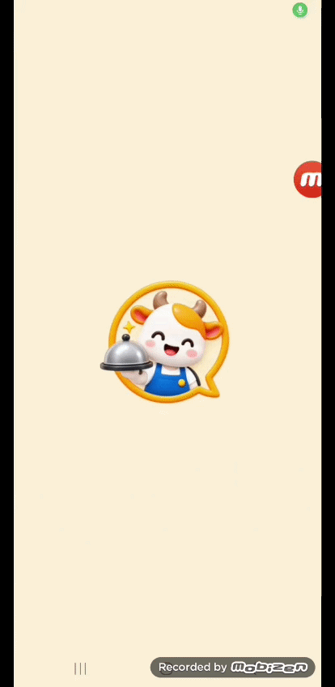

Desde el ícono en el teléfono: la splash animada con el logo, el nombre del grupo y los apellidos y nombres de los cuatro integrantes, y su transición a la pantalla de presentación. También está en [video](docs/imagenes/pantallas/01-animacion-de-ingreso.mp4), con mejor calidad.

### Del 2 al 18 · Recorrido

<table>
  <tr>
    <td align="center" width="25%">
      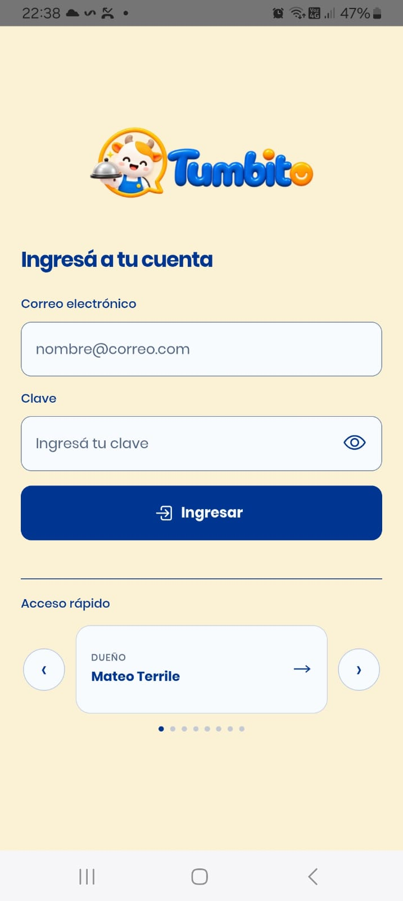 
      <b>2 · Ingreso</b> Formulario validado y accesos rápidos.
    </td>
    <td align="center" width="25%">
      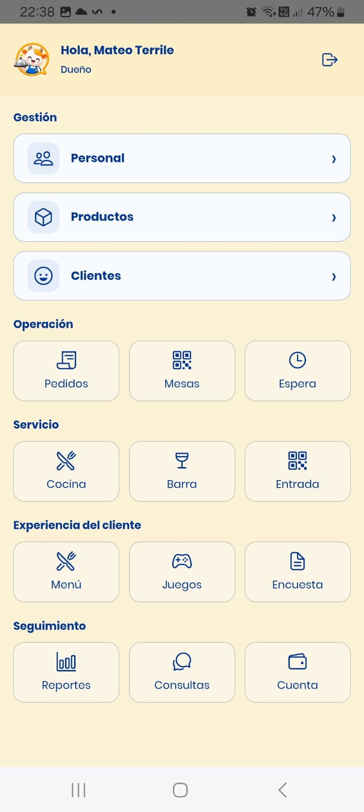 
      <b>3 · Pantalla principal</b> Vista inicial según el perfil.
    </td>
    <td align="center" width="25%">
      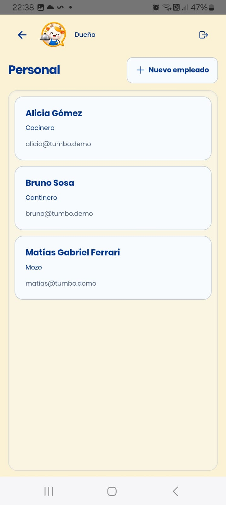 
      <b>4 · Personal</b> Gestión y alta de empleados.
    </td>
  </tr>
  <tr>
    <td align="center" width="25%">
      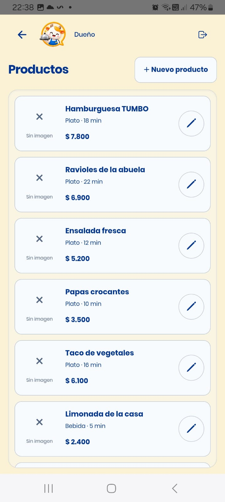 
      <b>5 · Productos</b> Alta y catálogo de platos y bebidas.
    </td>
    <td align="center" width="25%">
      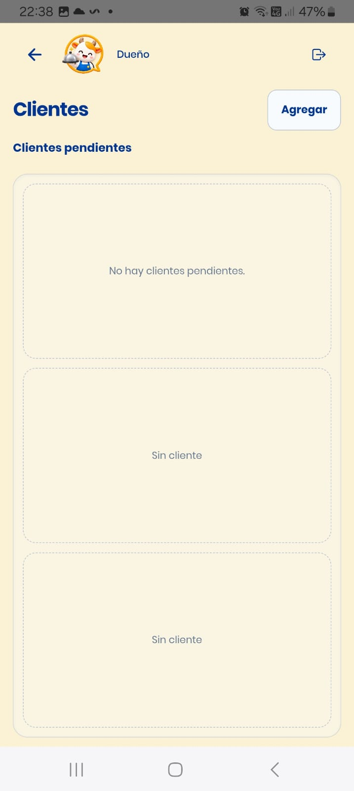 
      <b>6 · Clientes pendientes</b> Aprobación y control de registros.
    </td>
    <td align="center" width="25%">
      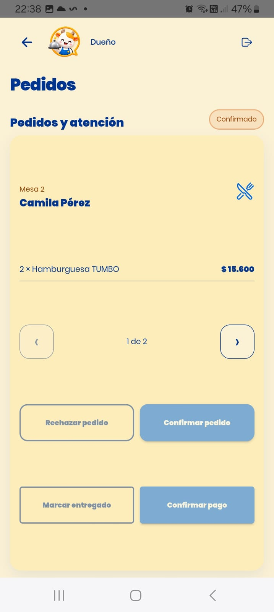 
      <b>7 · Pedidos</b> Realización y seguimiento de órdenes.
    </td>
    <td align="center" width="25%">
      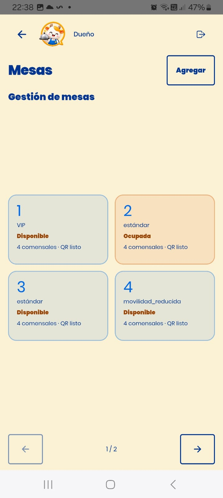 
      <b>8 · Mesas</b> Gestión y generación de códigos QR.
    </td>
  </tr>
  <tr>
    <td align="center" width="25%">
      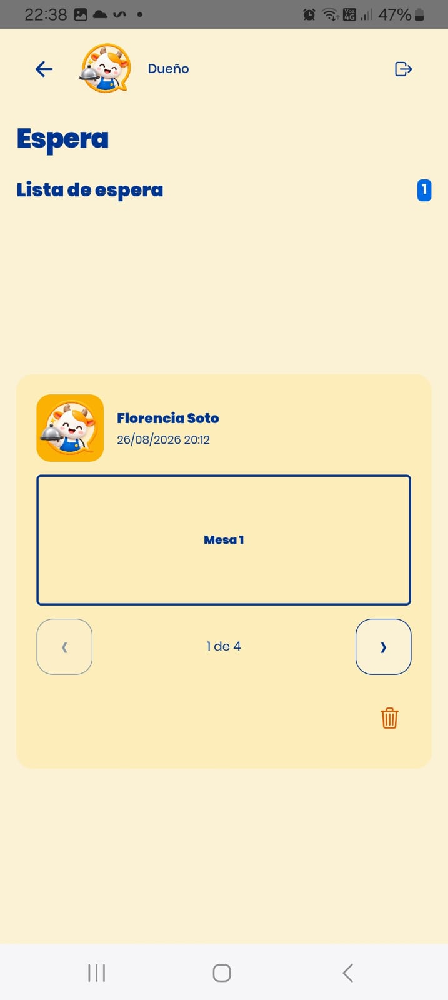 
      <b>9 · Lista de espera</b> Control de ingresos y anónimos.
    </td>
    <td align="center" width="25%">
      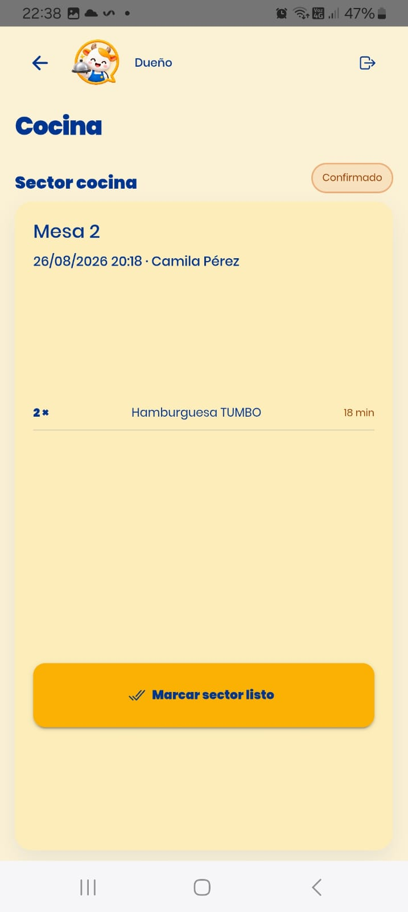 
      <b>10 · Cocina</b> Recepción y preparación de comandas.
    </td>
    <td align="center" width="25%">
      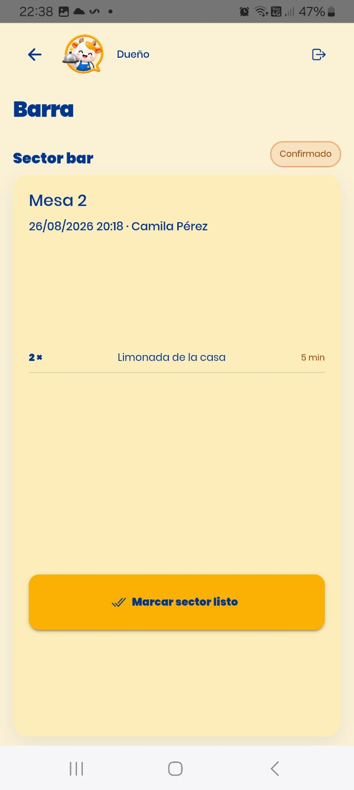 
      <b>11 · Barra</b> Gestión de bebidas y pedidos de bar.
    </td>
    <td align="center" width="25%">
      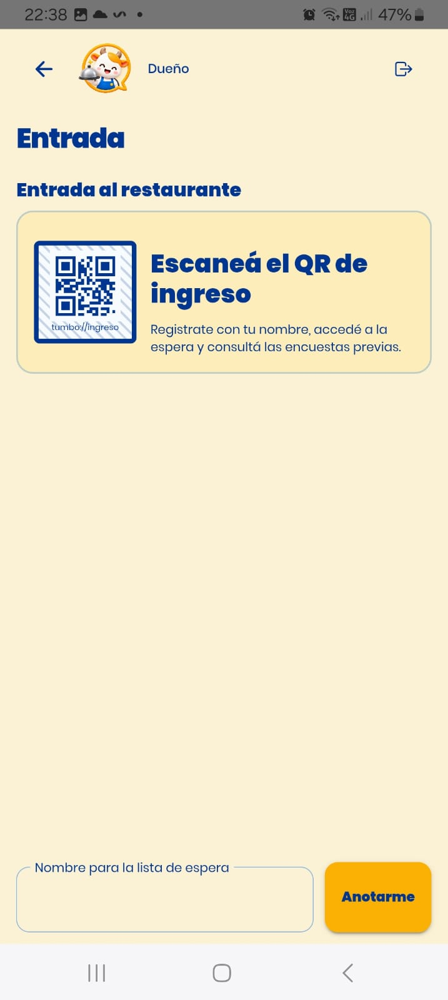 
      <b>12 · Entrada / QR</b> Vinculación y escaneo de ingreso.
    </td>
  </tr>
  <tr>
    <td align="center" width="25%">
      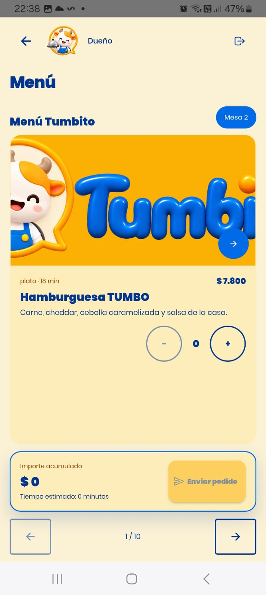 
      <b>13 · Menú y Carta</b> Selección de productos por mesa.
    </td>
    <td align="center" width="25%">
      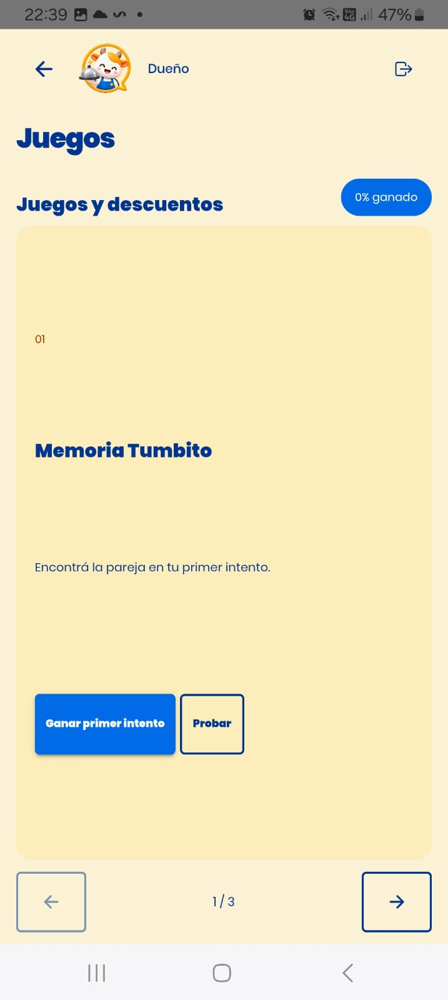 
      <b>14 · Juegos y beneficios</b> Descuentos y trivias para clientes.
    </td>
    <td align="center" width="25%">
      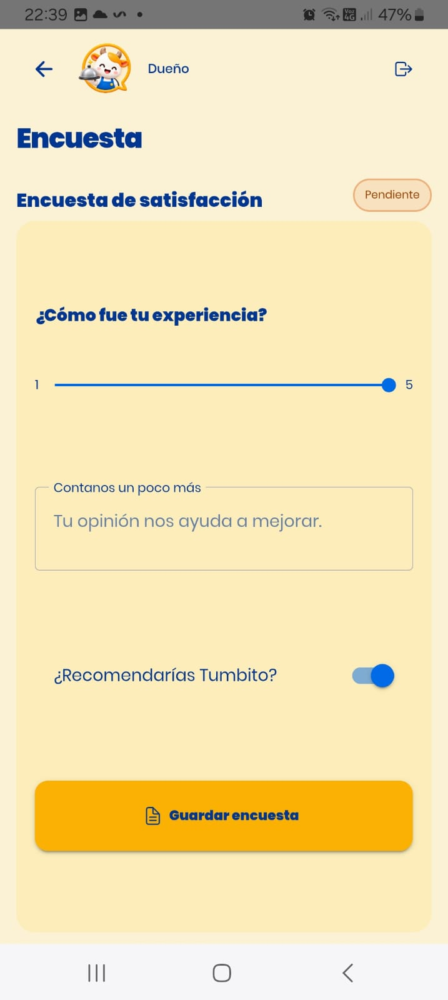 
      <b>15 · Encuesta</b> Opinión y experiencia del usuario.
    </td>
    <td align="center" width="25%">
      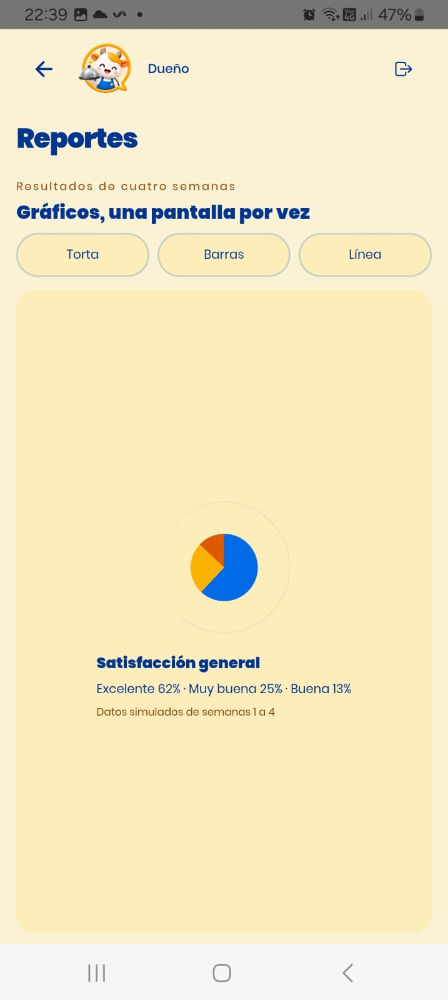 
      <b>16 · Reportes y gráficos</b> Estadísticas de satisfacción y ventas.
    </td>
  </tr>
  <tr>
    <td align="center" width="25%">
      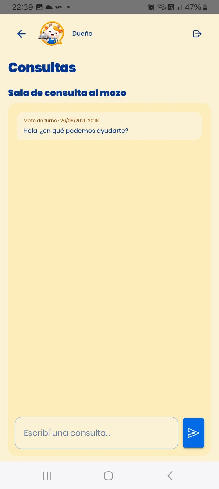 
      <b>17 · Consultas y chat</b> Comunicación directa con los mozos.
    </td>
    <td align="center" width="25%">
      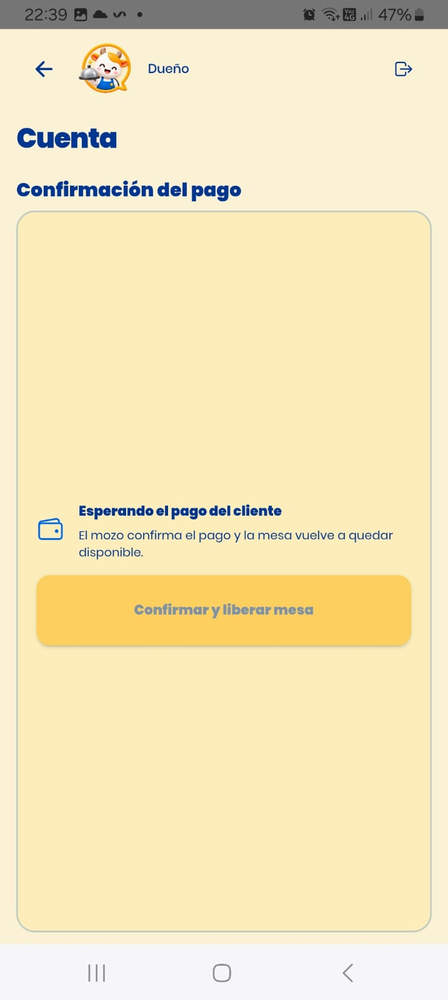 
      <b>18 · Cuenta y propina</b> Desglose de pago y liberación de mesa.
    </td>
    <td align="center" width="50%" colspan="2">
      <!-- Espacio reservado o descripción adicional si se desea -->
    </td>
  </tr>
</table>

## Perfiles de acceso

Los accesos rápidos se generan a partir de los usuarios aprobados existentes en Supabase. Las credenciales se administran mediante la configuración segura del entorno y no se publican en este README.

| Correo | Perfil |
|---|---|
| mateo@tumbo.demo | Dueño |
| ramiro@tumbo.demo | Supervisor |
| ignacio@tumbo.demo | Maitre |
| matias@tumbo.demo | Mozo |
| alicia@tumbo.demo | Cocinero |
| bruno@tumbo.demo | Cantinero |
| camila@tumbo.demo | Cliente registrado |
| anonimo@tumbo.demo | Cliente anónimo |

Después de ingresar, el botón Abrir centro de operación permite recorrer las funcionalidades disponibles para el perfil autenticado.

## Integrantes y responsabilidades

| Apellidos y nombres | Tareas asignadas | Branch | Inicio | Finalización |
|---|---|---|---|---|
| Terrile, Mateo (líder) | Arquitectura Angular/Ionic, navegación, diseño de presentación e ingreso, ilustraciones de marca, integración y coordinación técnica | `terrile` | 25/08/2026 | 30/09/2026 |
| Bianucci, Ramiro | Identidad visual, ícono, tipografías, recursos gráficos, contraste, configuración de Android Studio y sonidos de la aplicación | `bianucci` | 25/08/2026 | 12/09/2026 |
| Cruz, Ignacio Agustín | Base de Supabase, splash inicial, arreglos del formulario de ingreso y conexión del centro de operación con Supabase y realtime | `cruz` | 26/08/2026 | 15/09/2026 |
| Ferrari, Matías Gabriel | Esquema con RLS, Supabase Auth, accesos rápidos, sesión y logout, validaciones, requisitos excluyentes, empaquetado del APK y alta de empleado | `ferrari` | 26/08/2026 | 25/09/2026 |

La rama `main` queda reservada para la versión integrada que se presenta.

### Qué hizo cada uno

El detalle sale del historial del repositorio, no de la asignación previa: es lo que efectivamente está mergeado en `main`.

**Terrile, Mateo** — `terrile`
- Estructura inicial del proyecto Angular + Ionic, rutas y navegación entre pantallas.
- Diseño de la pantalla de presentación y del ingreso, con sus sucesivas remodelaciones.
- Componente compartido `fondo-decorativo`, que es el fondo animado de presentación e ingreso.
- Ilustraciones de Tumbito: originales, SVG, webp y previsualizaciones en `assets/tumbito`, más los íconos de `public/icons`.
- Integración de las ramas en `main` y coordinación técnica del equipo.

**Bianucci, Ramiro** — `bianucci`
- Tipografías del proyecto: la familia Poppins completa y Oh Chewy para la marca.
- Recursos gráficos e ilustraciones bajo `public/assets/tumbito`, con sus variantes y reportes de contraste.
- Ajustes de la pantalla de presentación y de los estilos globales.
- Configuración del proyecto en Android Studio y de los recursos nativos.
- Sonidos de la aplicación: apertura al iniciar y cierre al salir, con `AppAudio` sobre `native-audio`.
- Agregado de vibración con "haptics" Capacitor.
- Funcionalidades Login(Ingreso Rápido)

**Cruz, Ignacio Agustín** — `cruz`
- Primeras migraciones de Supabase y datos de prueba (`supabase/migrations`, `supabase/seed_data`).
- Primera versión de la splash screen y arreglos del formulario de ingreso.
- Conexión del centro de operación con Supabase y realtime (`operacion.service.ts`, `operacion.component.ts`).
- Ultimos cambios de diseño frontend (Android)

**Ferrari, Matías Gabriel** — `ferrari`
- Esquema completo con RLS, autenticación real de Supabase, accesos rápidos, control de estados pendiente y rechazado, y restauración de sesión.
- Seguridad de la base: cierre de la escalada de privilegios y protección de las columnas de autorización.
- Validadores reutilizables en `core/validacion` espejados con las restricciones de la base de datos.
- Requisitos excluyentes R5, R9, R10, R11 y R13.
- Empaquetado del APK: proyecto Android, íconos adaptables y la guía de `docs/apk.md`.
- Rendimiento de la splash: ilustraciones responsive y precarga diferida.
- Altas 01-04: Edge Functions de servidor (`crear-empleado`, `guardar-producto`, `guardar-mesa`), validación estricta de CUIL/DNI y persistencia.

## Estado de los 22 puntos

Ningún punto está 100% cerrado todavía debido a validaciones físicas pendientes o bloqueos de backend detallados en la auditoría técnica.

| # | Funcionalidad | Estado | Responsable | Problema actual / Faltante |
|---|---|---|---|---|
| 1 | Agregar un empleado | Parcial | Ferrari | Desplegado en remoto; validaciones y fotos correctas. Falta validación física en dispositivo Android. |
| 2 | Agregar un nuevo plato | Parcial | Ferrari | Desplegado; exige 3 fotos navegables y valida rangos. Falta captura fotográfica nativa. |
| 3 | Agregar una nueva bebida | Parcial | Ferrari | Desplegado en bar. Falta captura fotográfica nativa. |
| 4 | Agregar una nueva mesa | Parcial | Ferrari | Desplegado con token QR y protección activa. Falta cámara nativa. |
| 5 | Crear un cliente registrado | En curso | Ferrari | Alta mock/memoria. Falta Auth real, contraseña, cámara de fotos y correo automático. |
| 6 | Verificar ingreso de cliente | En curso | Cruz | Funciona vista en demo, pero no recarga listado al actualizar ni envía Push. |
| 7 | Rechazo de cliente | En curso | Cruz | Cambio de estado aislado; no hay envío de correos, ni plantillas personalizadas. |
| 8 | Aceptación de cliente | Parcial | Cruz | Update en DB, pero falta disparador de correos de resolución. |
| 9 | Cliente anónimo y espera | En curso | Cruz | Sin Auth real, no lee QR óptico y el cliente puede autoasignarse mesa sin pasar por espera. |
| 10 | Metre asigna mesa a un cliente | En curso | Cruz | Escrituras parciales no atómicas; RLS permisiva que falla al actualizar la mesa. |
| 11 | Menú por QR de mesa y consulta | En curso | Cruz | Carta funcional pero el chat falla (autor figura como "Equipo TUMBO", mozos ven sesiones ajenas). No hay Push. |
| 12 | Cliente realiza el pedido | En curso | Terrile | **Bloqueo RLS (P0)**: intenta insertar pedido `pendiente_confirmacion` vacío, generando error 42501. |
| 13 | Mozo rechaza el pedido | En curso | Terrile | No se precarga el pedido para editar tras rechazo; el reenvío duplica órdenes en la base. |
| 14 | Mozo confirma y deriva a sectores | En curso | Terrile | Cocinero puede confirmar indebidamente (falla RLS); los juegos no están implementados. |
| 15 | Juegos y descuentos (excluyente) | Por hacer | — | Botones mock sin lógica. Los descuentos se pierden al recargar sesión y permiten manipulación desde el cliente. |
| 16 | Cocina recibe sus productos | En curso | Terrile | UI funciona en demo pero el servicio consulta solo 1 sesión (limit 1); no agrupa pedidos de varias mesas reales. |
| 17 | Bar recibe sus productos | En curso | Bianucci | Igual que cocina, carece de listado multi-mesa real. |
| 18 | Sectores avisan pedido completo | En curso | Bianucci | Demo genera avisos duplicados; falta Push real al mozo al terminar todos los sectores. |
| 19 | Mozo entrega el pedido completo | En curso | Bianucci | **Bloqueo SQL (P0)**: Columna `recibido_en` no existe en la base, impidiendo la confirmación. |
| 20 | Encuesta y gráficos (excluyente) | En curso | Bianucci | Formulario no guarda las respuestas en la base de datos; los gráficos muestran datos 100% estáticos (mock). |
| 21 | Cuenta y propina por QR | En curso | Bianucci | Total funciona en demo, pero el backend confía en cálculos alterables del cliente; falta lectura óptica del QR. |
| 22 | Confirmación de pago y liberación | En curso | Bianucci | Un cliente propietario puede invocar el cierre por su cuenta. Además, hay herencia de carrito al cambiar de usuario (SPA no limpia estado). |
### Lo que destraba al resto

Para lograr la funcionalidad integral requerida, se deben resolver las siguientes áreas prioritarias (detalladas en el reporte de auditoría):

| Habilitador (Bloqueos Actuales) | Destraba |
|---|---|
| **Transacciones atómicas y RLS seguras (P0)** | Puntos 10, 12, 14, 19, 21 y 22 (Ej: Envíos de pedidos, recibos de entrega, cálculos de propina/cuentas). |
| **Limpieza de estado en cliente (P0)** | Herencia de sesiones en la SPA (Puntos 15 y 22). |
| **Cámara del dispositivo y Lector Óptico QR** | Puntos 1, 2, 3, 4, 5, 9, 10, 11, 21 y 22 (Reemplazar simuladores por plugins físicos). |
| **Notificaciones Push y Correos (Eventos)** | Puntos 5, 6, 7, 8, 9, 10, 11, 12, 13, 14, 18, 21 y 22 |
| **Unificar sistemas de sonido** | Deuda técnica (`SonidosService` vs `AppAudio`) |

## Identidad visual

| Uso | Color |
|---|---|
| Amarillo de marca | #FBB103 |
| Crema brillante | #FCEDBB |
| Naranja sombreado | #DC5B02 |
| Fondo crema | #FBF1D5 |
| Azul de acento | #006AE7 |
| Azul brillante | #F8FBFD |
| Azul sombreado | #003592 |

Se usa #003592 para texto corriente por contraste, #006AE7 para acciones y títulos destacados, y amarillo/naranja para la marca y estados.

## Recursos

- [Ícono](docs/imagenes/logo.png)
- [Logo con nombre](docs/imagenes/logo-nombre.png)
- [Splash estática](docs/imagenes/splash-estatica.svg)
- [Video de la animación de ingreso](docs/imagenes/pantallas/01-animacion-de-ingreso.mp4)
- [Puesta en marcha de Supabase](supabase/README.md)
- [Auditoría de cumplimiento](docs/AUDITORIA_CUMPLIMIENTO.md)
- [Guía para armar el APK](docs/apk.md)
- [Consigna original del TFI](docs/Trabajo-practico-2026-TFI.pdf)
- [Contexto ampliado del proyecto](CONTEXTO-PROYECTO.md)
- [Manual visual de referencia](docs/manual-tfi.html)
- [Reglas para agentes y equipo](AGENTS.md)

## Índice visual

### Marca

### Códigos QR

- [QR de ingreso](docs/imagenes/qr-entrada.png)
- [QR de mesa 1](docs/imagenes/qr-mesa-1.png)
- [QR de mesa 2](docs/imagenes/qr-mesa-2.png)
- [QR de mesa 3](docs/imagenes/qr-mesa-3.png)
- [QR de mesa 4](docs/imagenes/qr-mesa-4.png)
- [QR de mesa 5](docs/imagenes/qr-mesa-5.png)
- [QR de propina 0%](docs/imagenes/qr-propina-0.png)
- [QR de propina 5%](docs/imagenes/qr-propina-5.png)
- [QR de propina 10%](docs/imagenes/qr-propina-10.png)
- [QR de propina 15%](docs/imagenes/qr-propina-15.png)
- [QR de propina 20%](docs/imagenes/qr-propina-20.png)

Las imágenes utilizadas por las pantallas y sus variantes se encuentran en `public/imagenes` y `assets/tumbito`.

## Arquitectura

    src/app/
    ├── core/
    │   ├── demo/
    │   ├── guards/
    │   ├── imagenes/
    │   ├── models/
    │   ├── rutas/
    │   ├── services/
    │   └── validacion/
    ├── features/
    │   ├── presentacion/
    │   ├── ingreso/
    │   ├── inicio/
    │   └── operacion/
    ├── services/
    └── shared/
        └── components/

    supabase/
    ├── functions/       Edge Functions (alta de empleado, productos, mesas)
    └── migrations/      Esquema, políticas RLS, límites y triggers

Las rutas de funcionalidades se cargan de forma lazy y se precargan recién cuando la splash terminó, para no comerle cuadros a la animación. La ruta `splash` muestra el logo durante el primer render y deriva a `presentacion`, que contiene la pantalla de bienvenida interactiva. Los componentes usan standalone, signals, formularios reactivos y estilos SCSS mobile first. Capacitor queda inicializado en `capacitor.config.ts`; `npm run cap:sync` sincroniza el build web con las plataformas nativas y `npm run apk` prepara el paquete de Android.

Las pruebas corren con `npm test`.

## Criterios acordados

- Todo texto visible está en español y conserva sus tildes.
- No se usa alert().
- No se usa modo oscuro ni fondos blancos o negros puros.
- Los errores se muestran dentro de la pantalla, con su propio cartel y vibración.
- El logo se conserva como recurso original y se reutiliza sin deformarlo.
- La autenticación real utiliza Supabase Auth detrás de un adaptador desacoplado.
- Los accesos rápidos se cargan desde los perfiles autorizados de Supabase.
- El cierre de sesión invalida la sesión, limpia el estado de la aplicación y vuelve al ingreso.
- Las validaciones se aplican en la interfaz y se refuerzan con restricciones de la base de datos (CHECKs y RLS).
- Las operaciones críticas (altas 01-04) utilizan Edge Functions para su resolución segura en el servidor.
- Las credenciales privadas nunca se guardan en el repositorio.
