# Tumbito — Trabajo Final Integrador 2026

Aplicación móvil de gestión de restaurante para la Tecnicatura Universitaria en Programación (UTN Avellaneda).

## Estado actual

La aplicación Angular + Ionic está integrada parcialmente. La entrega actual incluye:

- identidad visual basada en el logo entregado;
- splash animada con el logo, que deriva a la pantalla de presentación;
- fondo decorativo con las ilustraciones de la marca, servidas en el tamaño que le corresponde a cada pantalla;
- pantalla de bienvenida separada con marca, ingreso y metadata institucional;
- formulario de ingreso con validación visible de correo y clave;
- accesos rápidos por perfiles autorizados;
- sesión, cierre de sesión y navegación por pantalla;
- centro de operación responsive para el flujo de los puntos 1 a 22;
- servicios para altas, catálogo, mesas, espera, pedidos, cocina, bar, juegos, encuestas, cuenta, propina y pago;
- sonido de apertura y de cierre, y vibración ante los errores;
- APK de Android empaquetada con Capacitor (ver [guía del APK](docs/apk.md)).

**Actualización de integración (02/10/2026):** la base y las funciones de Supabase están en producción (`weeemajondwqstaoldtu`). El circuito de una mesa, del pedido a la mesa libre (puntos 11 a 14 y 16 a 22), funciona contra la base real, con realtime y push, y está probado por pantalla en la base local de Docker (`supabase/tests/ui-*.mjs`). El estado de cada punto está en la tabla de abajo.

La aplicación está desplegada en Vercel y disponible en [tumbito.vercel.app](https://tumbito.vercel.app).

La configuración de Supabase se gestiona mediante variables de entorno protegidas. Nunca se guardan claves privadas ni claves `service_role` en el repositorio.

El reparto y el avance de los 22 puntos, así como la auditoría técnica detallada, se siguen en el tablero de GitHub Projects del repositorio y en `docs/AUDITORIA_CUMPLIMIENTO.md`.

## Pantallas de la aplicación

Capturas tomadas del APK corriendo en un teléfono Android.

### 1 · Al entrar

Desde el ícono en el teléfono: la splash animada con el logo, el nombre del grupo y los apellidos y nombres de los cuatro integrantes, y su transición a la pantalla de presentación.

### Del 2 al 18 · Recorrido

<table>
  <tr>
    <td align="center" width="25%">
      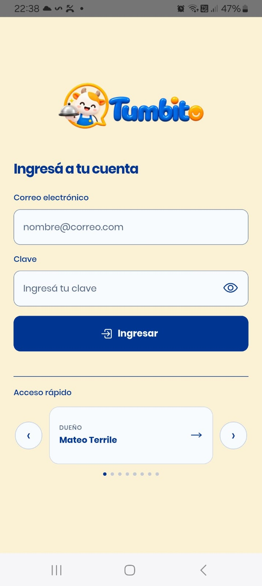 
      <b>2 · Ingreso</b> Formulario validado y accesos rápidos.
    </td>
    <td align="center" width="25%">
      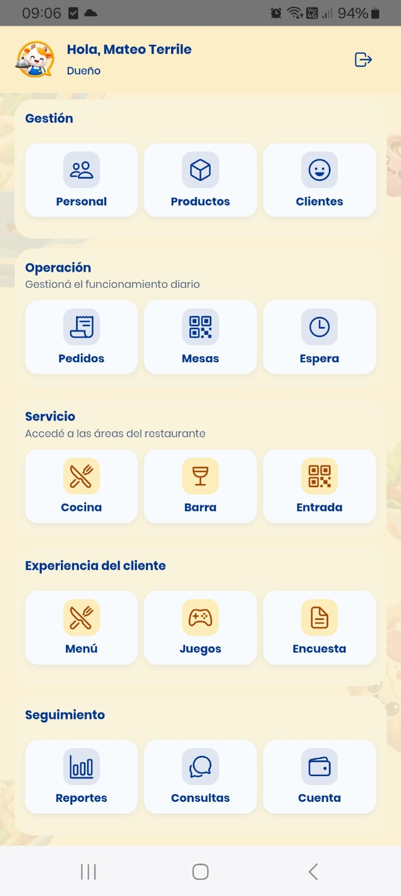 
      <b>3 · Pantalla principal</b> Vista inicial según el perfil.
    </td>
    <td align="center" width="25%">
      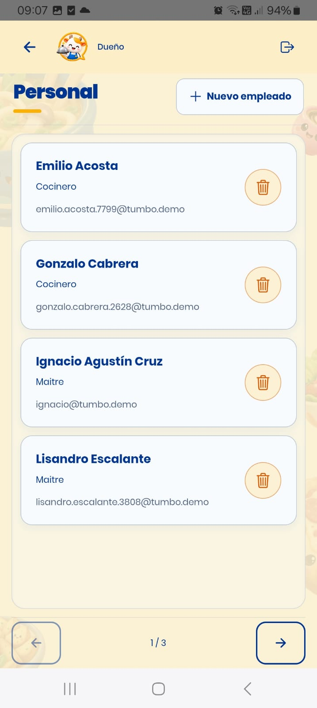 
      <b>4 · Personal</b> Gestión y alta de empleados.
    </td>
  </tr>
  <tr>
    <td align="center" width="25%">
      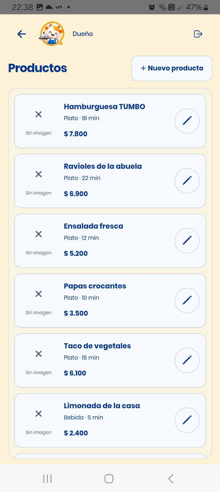 
      <b>5 · Productos</b> Alta y catálogo de platos y bebidas.
    </td>
    <td align="center" width="25%">
      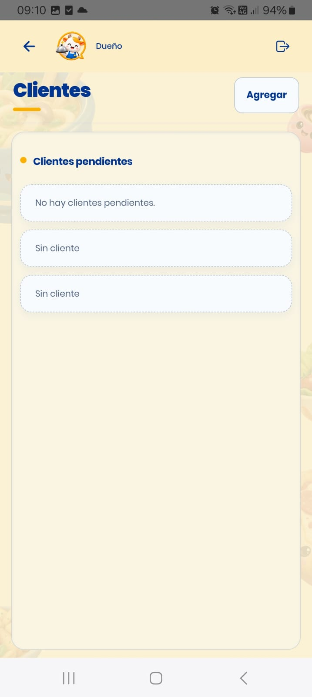 
      <b>6 · Clientes pendientes</b> Aprobación y control de registros.
    </td>
    <td align="center" width="25%">
      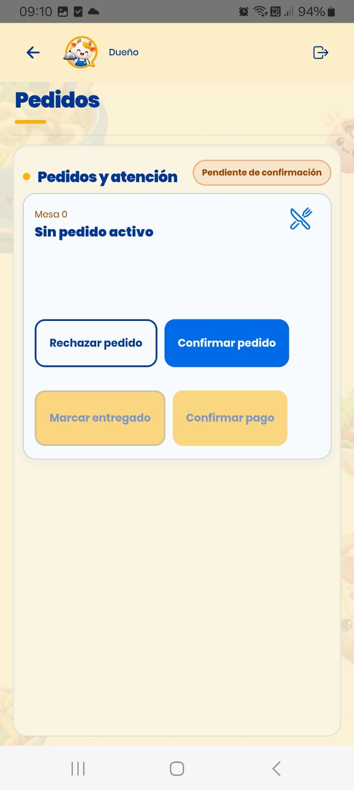 
      <b>7 · Pedidos</b> Realización y seguimiento de órdenes.
    </td>
    <td align="center" width="25%">
      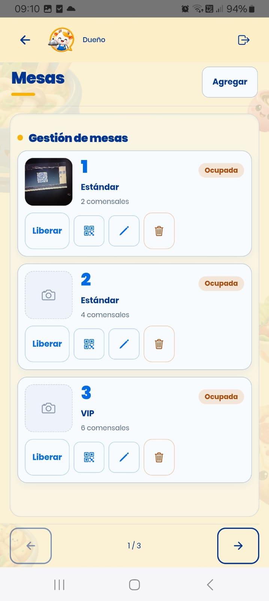 
      <b>8 · Mesas</b> Gestión y generación de códigos QR.
    </td>
  </tr>
  <tr>
    <td align="center" width="25%">
      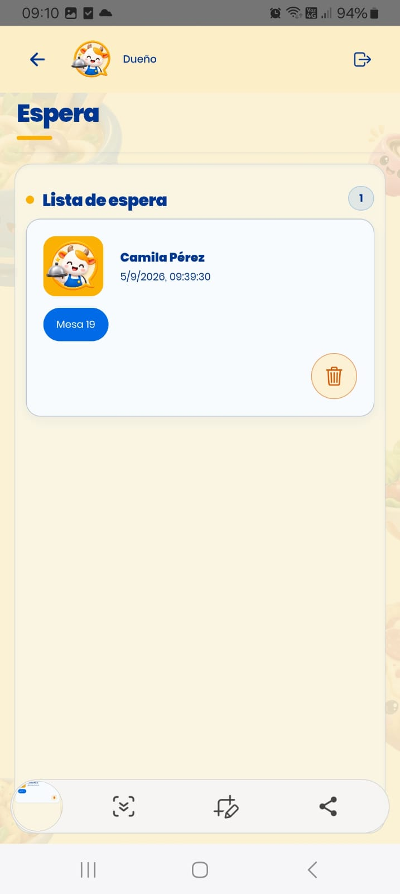 
      <b>9 · Lista de espera</b> Control de ingresos y anónimos.
    </td>
    <td align="center" width="25%">
      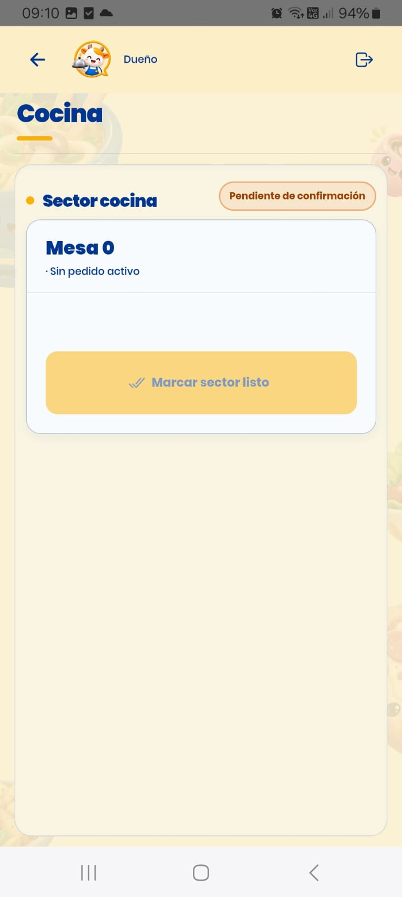 
      <b>10 · Cocina</b> Recepción y preparación de comandas.
    </td>
    <td align="center" width="25%">
      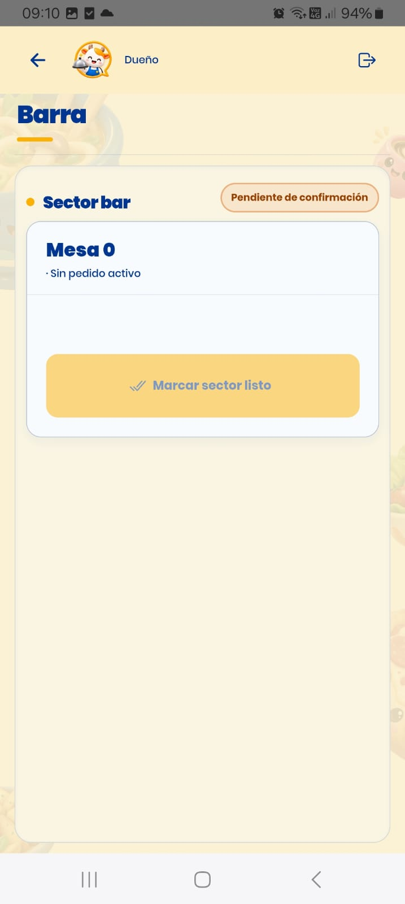 
      <b>11 · Barra</b> Gestión de bebidas y pedidos de bar.
    </td>
    <td align="center" width="25%">
      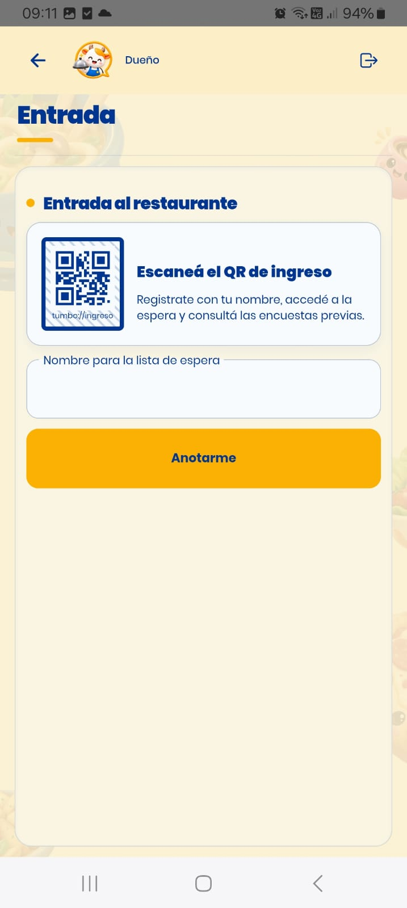 
      <b>12 · Entrada / QR</b> Vinculación y escaneo de ingreso.
    </td>
  </tr>
  <tr>
    <td align="center" width="25%">
      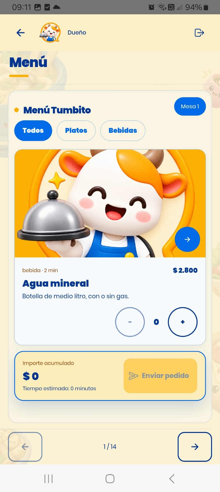 
      <b>13 · Menú y Carta</b> Selección de productos por mesa.
    </td>
    <td align="center" width="25%">
      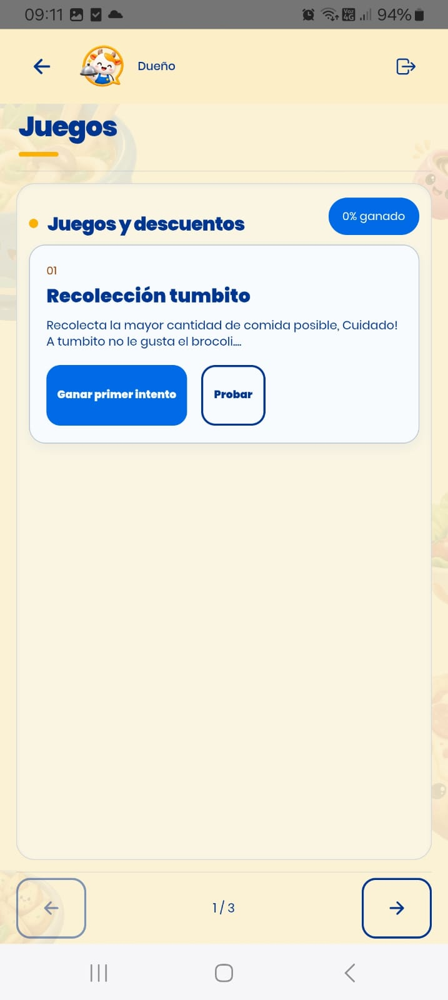 
      <b>14 · Juegos y beneficios</b> Descuentos y trivias para clientes.
    </td>
    <td align="center" width="25%">
      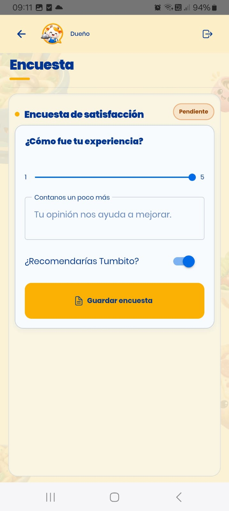 
      <b>15 · Encuesta</b> Opinión y experiencia del usuario.
    </td>
    <td align="center" width="25%">
      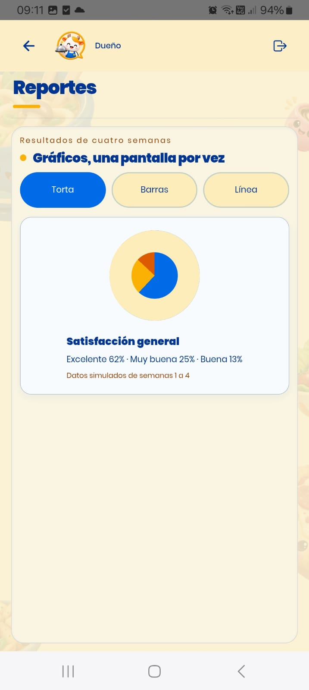 
      <b>16 · Reportes y gráficos</b> Estadísticas de satisfacción y ventas.
    </td>
  </tr>
  <tr>
    <td align="center" width="25%">
      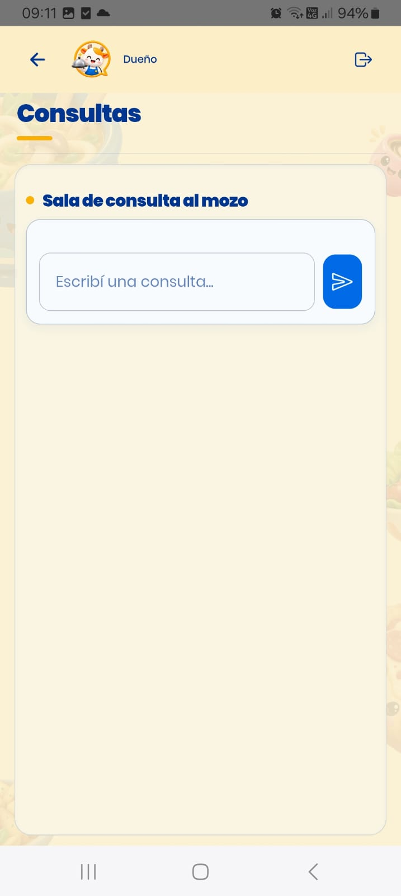 
      <b>17 · Consultas y chat</b> Comunicación directa con los mozos.
    </td>
    <td align="center" width="25%">
      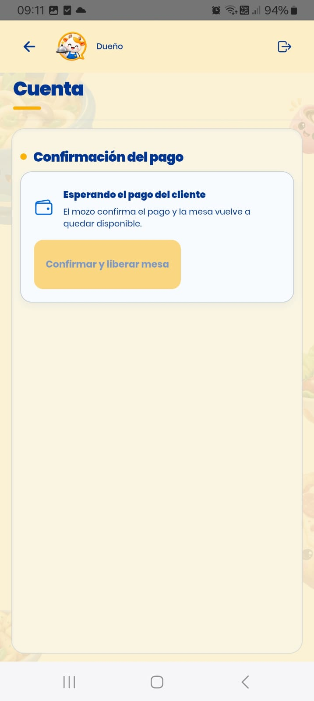 
      <b>18 · Cuenta y propina</b> Desglose de pago y liberación de mesa.
    </td>
    <td align="center" width="50%" colspan="2">
      <!-- Espacio reservado o descripción adicional si se desea -->
    </td>
  </tr>
</table>

## Perfiles de acceso

Los accesos rápidos se generan a partir de los usuarios aprobados existentes en Supabase. Las credenciales se administran mediante la configuración segura del entorno y no se publican en este README.

| Correo | Perfil |
|---|---|
| mateo@tumbo.demo | Dueño |
| ramiro@tumbo.demo | Supervisor |
| ignacio@tumbo.demo | Maitre |
| matias@tumbo.demo | Mozo |
| alicia@tumbo.demo | Cocinero |
| bruno@tumbo.demo | Cantinero |
| camila@tumbo.demo | Cliente registrado |
| anonimo@tumbo.demo | Cliente anónimo |

Después de ingresar, el botón Abrir centro de operación permite recorrer las funcionalidades disponibles para el perfil autenticado.

## Integrantes y responsabilidades

| Apellidos y nombres | Tareas asignadas | Branch | Inicio | Finalización |
|---|---|---|---|---|
| Terrile, Mateo (líder) | Arquitectura Angular/Ionic, navegación, diseño de presentación e ingreso, ilustraciones de marca, integración y coordinación técnica | `terrile` | 25/08/2026 | 30/09/2026 |
| Bianucci, Ramiro | Identidad visual, ícono, tipografías, recursos gráficos, contraste, configuración de Android Studio y sonidos de la aplicación | `bianucci` | 25/08/2026 | 12/09/2026 |
| Cruz, Ignacio Agustín | Base de Supabase, splash inicial, arreglos del formulario de ingreso y conexión del centro de operación con Supabase y realtime | `cruz` | 26/08/2026 | 15/09/2026 |
| Ferrari, Matías Gabriel | Esquema con RLS, Supabase Auth, accesos rápidos, sesión y logout, validaciones, requisitos excluyentes, empaquetado del APK y alta de empleado | `ferrari` | 26/08/2026 | 25/09/2026 |

La rama `main` queda reservada para la versión integrada que se presenta.

### Qué hizo cada uno

El detalle sale del historial del repositorio, no de la asignación previa: es lo que efectivamente está mergeado en `main`.

**Terrile, Mateo** — `terrile`
- Estructura inicial del proyecto Angular + Ionic, rutas y navegación entre pantallas.
- Diseño de la pantalla de presentación y del ingreso, con sus sucesivas remodelaciones.
- Componente compartido `fondo-decorativo`, que es el fondo animado de presentación e ingreso.
- Ilustraciones de Tumbito: originales, SVG, webp y previsualizaciones en `assets/tumbito`, más los íconos de `public/icons`.
- Integración de las ramas en `main` y coordinación técnica del equipo.

**Bianucci, Ramiro** — `bianucci`
- Tipografías del proyecto: la familia Poppins completa y Oh Chewy para la marca.
- Recursos gráficos e ilustraciones bajo `public/assets/tumbito`, con sus variantes y reportes de contraste.
- Ajustes de la pantalla de presentación y de los estilos globales.
- Configuración del proyecto en Android Studio y de los recursos nativos.
- Sonidos de la aplicación: apertura al iniciar y cierre al salir, con `AppAudio` sobre `native-audio`.
- Agregado de vibración con "haptics" Capacitor.
- Funcionalidades Login(Ingreso Rápido)

**Cruz, Ignacio Agustín** — `cruz`
- Primeras migraciones de Supabase y datos de prueba (`supabase/migrations`, `supabase/seed_data`).
- Primera versión de la splash screen y arreglos del formulario de ingreso.
- Conexión del centro de operación con Supabase y realtime (`operacion.service.ts`, `operacion.component.ts`).
- Ultimos cambios de diseño frontend (Android)

**Ferrari, Matías Gabriel** — `ferrari`
- Esquema completo con RLS, autenticación real de Supabase, accesos rápidos, control de estados pendiente y rechazado, y restauración de sesión.
- Seguridad de la base: cierre de la escalada de privilegios y protección de las columnas de autorización.
- Validadores reutilizables en `core/validacion` espejados con las restricciones de la base de datos.
- Requisitos excluyentes R5, R9, R10, R11 y R13.
- Empaquetado del APK: proyecto Android, íconos adaptables y la guía de `docs/apk.md`.
- Rendimiento de la splash: ilustraciones responsive y precarga diferida.
- Altas 01-04: Edge Functions de servidor (`crear-empleado`, `guardar-producto`, `guardar-mesa`), validación estricta de CUIL/DNI y persistencia.

## Estado de los 22 puntos

Verificado el 02/10/2026 con el código de `main`, la base de producción (solo lecturas) y las pruebas locales. «Completo» quiere decir funcionando en producción y cubierto por pruebas automáticas; lo que solo se puede comprobar con un teléfono en la mano (cámara, push con la aplicación cerrada, sonidos, vibración) queda indicado.

| # | Funcionalidad | Estado | Responsable | Detalle |
|---|---|---|---|---|
| 1 | Agregar un empleado | Completo en código | Ferrari | Función `crear-empleado` con validaciones. Faltan datos: 9 de 11 empleados no tienen foto. |
| 2 | Agregar un plato | Completo en código | Ferrari | Exige 3 fotos. Hay 5 platos con sus 3 fotos; «Papas fritas» no tiene ninguna. |
| 3 | Agregar una bebida | **Faltan datos** | Ferrari | El cliente ve solo 3 bebidas y una se llama «prueba»: el enunciado pide 5. Los postres no se ven (tienen 1 foto). |
| 4 | Agregar una mesa | Completo en código | Ferrari | Genera el QR. Solo 2 de 9 mesas tienen foto y hay números de prueba (6, 8, 19, 26). |
| 5 | Registro de cliente | Completo en código | Ferrari | El alta crea el cliente pendiente y encola la push; los triggers están en `20261002123318_avisos_registro_y_permisos.sql`. |
| 6 | Clientes pendientes | Parcial | Cruz | La push a dueño y supervisor sale; solo el dueño tiene un teléfono registrado. |
| 7-8 | Rechazo y aceptación | Completo en código | Cruz | Brevo envía los correos; el aviso lee dirección y firma de Vault. El logo se descarga del repositorio, que hoy es público. |
| 9 | Cliente anónimo y espera | **Bloqueado por configuración** | Cruz / Terrile | Funciona de punta a punta en local (`tests/ui-punto-9.mjs`): entrada sin cuenta, nombre y foto, lista de espera con push al metre, el metre lo ve y lo quita, y resultados sin cuenta. En producción falta activar *Anonymous sign-ins* en Supabase Auth; hasta entonces la app lo explica. |
| 10 | Metre asigna mesa | Completo | Cruz | El metre asigna con `asignar_mesa_a_cliente` (atómica); el cliente recibe push y la ve en vivo, y se sienta escaneando el QR de ESA mesa: otro QR se rechaza y la mesa no se le ofrece a nadie más (`tests/ui-punto-10.mjs`). |
| 11 | Menú y consulta al mozo | Completo | Cruz / Terrile | Consulta por mesa con fecha y hora; el mozo elige a qué mesa responde. Push a los mozos y al cliente. |
| 12 | Realizar pedido | Completo | Terrile | `enviar_pedido` crea el pedido y sus ítems en una sola operación; push a los mozos. |
| 13 | Rechazar pedido | Completo | Terrile | El mozo escribe el motivo; el cliente lo ve, recibe push y retoma el pedido en el carrito. |
| 14 | Confirmar y derivar | Completo | Terrile | Push a cocina con sus platos, al bar con sus bebidas y al cliente. Los juegos se habilitan. |
| 15 | Juegos y descuento | Completo | Bianucci / Terrile | Tres juegos reales: «Recolección tumbito» (10 %, el de Bianucci, se gana con 50 puntos en 10 segundos), «Adivinanza del número» (15 %) y «Piedra, papel o tijera» (20 %). El descuento lo decide la base: solo al primer intento y uno por visita (`tests/ui-punto-15.mjs`, `partidas.test.sql`). |
| 16-17 | Cocina y bar | Completo | Terrile | Listado por mesa, la más vieja primero, en vivo. |
| 18 | Pedido completo | Completo | Terrile | Push al mozo cuando cocina y bar terminan. |
| 19 | Entrega y recepción | Completo | Terrile | El mozo entrega y el cliente confirma; eso habilita encuesta y cuenta. |
| 20 | Encuesta y gráficos | Completo | Terrile | 7 preguntas con controles distintos; torta, barras y línea con 4 semanas de historial. |
| 21 | Cuenta y propina | Completo | Terrile | QR de propina, detalle, total calculado por la base, pago simulado y push. |
| 22 | Confirmación y mesa libre | Completo | Terrile | El mozo confirma por mesa, la mesa se libera y se verifica por QR; push a gerencia. |

Para que las push lleguen, cada perfil tiene que abrir la aplicación una vez en un teléfono con Android: hoy solo el dueño tiene un dispositivo registrado.

### Lo que falta

| Pendiente | Puntos |
|---|---|
| Habilitar los ingresos anónimos en Supabase Auth | 9 |
| Cargar fotos y productos reales; borrar «prueba» y las mesas de prueba | 1 a 4 |
| Registrar un teléfono por perfil | Todas las push |
| Hacer privado el repositorio y mover el logo de los correos | 7 y 8 |

## Identidad visual

| Uso | Color |
|---|---|
| Amarillo de marca | #FBB103 |
| Crema brillante | #FCEDBB |
| Naranja sombreado | #DC5B02 |
| Fondo crema | #FBF1D5 |
| Azul de acento | #006AE7 |
| Azul brillante | #F8FBFD |
| Azul sombreado | #003592 |

Se usa #003592 para texto corriente por contraste, #006AE7 para acciones y títulos destacados, y amarillo/naranja para la marca y estados.

## Recursos

- [Ícono](docs/imagenes/logo.png)
- [Logo con nombre](docs/imagenes/logo-nombre.png)
- [Splash estática](docs/imagenes/splash-estatica.svg)
- [Video de la animación de ingreso](docs/imagenes/pantallas/01-animacion-de-ingreso.mp4)
- [Puesta en marcha de Supabase](supabase/README.md)
- [Auditoría de cumplimiento](docs/AUDITORIA_CUMPLIMIENTO.md)
- [Guía para armar el APK](docs/apk.md)
- [Consigna original del TFI](docs/Trabajo-practico-2026-TFI.pdf)
- [Contexto ampliado del proyecto](CONTEXTO-PROYECTO.md)
- [Manual visual de referencia](docs/manual-tfi.html)
- [Reglas para agentes y equipo](AGENTS.md)

## Índice visual

### Marca

### Códigos QR

- [QR de ingreso](docs/imagenes/qr-entrada.png)
- [QR de mesa 1](docs/imagenes/qr-mesa-1.png)
- [QR de mesa 2](docs/imagenes/qr-mesa-2.png)
- [QR de mesa 3](docs/imagenes/qr-mesa-3.png)
- [QR de mesa 4](docs/imagenes/qr-mesa-4.png)
- [QR de mesa 5](docs/imagenes/qr-mesa-5.png)
- [QR de propina 0%](docs/imagenes/qr-propina-0.png)
- [QR de propina 5%](docs/imagenes/qr-propina-5.png)
- [QR de propina 10%](docs/imagenes/qr-propina-10.png)
- [QR de propina 15%](docs/imagenes/qr-propina-15.png)
- [QR de propina 20%](docs/imagenes/qr-propina-20.png)

Las imágenes utilizadas por las pantallas y sus variantes se encuentran en `public/imagenes` y `assets/tumbito`.

## Arquitectura

    src/app/
    ├── core/
    │   ├── demo/
    │   ├── guards/
    │   ├── imagenes/
    │   ├── models/
    │   ├── rutas/
    │   ├── services/
    │   └── validacion/
    ├── features/
    │   ├── presentacion/
    │   ├── ingreso/
    │   ├── inicio/
    │   └── operacion/
    ├── services/
    └── shared/
        └── components/

    supabase/
    ├── functions/       Edge Functions (alta de empleado, productos, mesas)
    └── migrations/      Esquema, políticas RLS, límites y triggers

Las rutas de funcionalidades se cargan de forma lazy y se precargan recién cuando la splash terminó, para no comerle cuadros a la animación. La ruta `splash` muestra el logo durante el primer render y deriva a `presentacion`, que contiene la pantalla de bienvenida interactiva. Los componentes usan standalone, signals, formularios reactivos y estilos SCSS mobile first. Capacitor queda inicializado en `capacitor.config.ts`; `npm run cap:sync` sincroniza el build web con las plataformas nativas y `npm run apk` prepara el paquete de Android.

Las pruebas corren con `npm test`.

## Criterios acordados

- Todo texto visible está en español y conserva sus tildes.
- No se usa alert().
- No se usa modo oscuro ni fondos blancos o negros puros.
- Los errores se muestran dentro de la pantalla, con su propio cartel y vibración.
- El logo se conserva como recurso original y se reutiliza sin deformarlo.
- La autenticación real utiliza Supabase Auth detrás de un adaptador desacoplado.
- Los accesos rápidos se cargan desde los perfiles autorizados de Supabase.
- El cierre de sesión invalida la sesión, limpia el estado de la aplicación y vuelve al ingreso.
- Las validaciones se aplican en la interfaz y se refuerzan con restricciones de la base de datos (CHECKs y RLS).
- Las operaciones críticas (altas 01-04) utilizan Edge Functions para su resolución segura en el servidor.
- Las credenciales privadas nunca se guardan en el repositorio.
